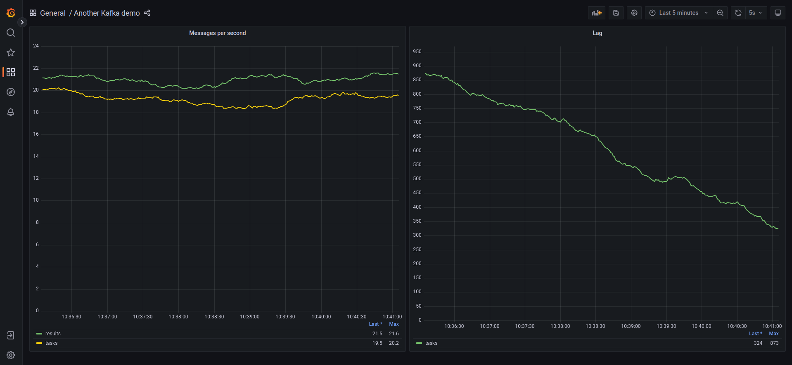

# Kafka + Grafana demo

This project is a demo of Ruby application using Kafka, monitored by Prometheus, with Grafana dashboard.

To try it out, run `docker compose up`, wait few minutes for topics to fill up with messages, then visit [Grafana](http://localhost:3000/d/jwPKIsniz/kafka-exporter-overview?orgId=1&refresh=5s) dashboard.

